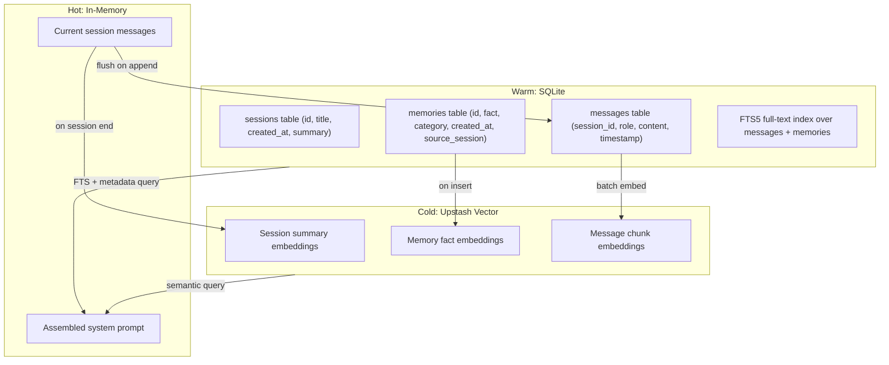

# Retain Persistence and Feature Architecture Plan

## Current State

Retain is a CLI chat app with persistent memory, built on Bun + Ink (React TUI). All persistence is file-based:

- **Sessions**: JSONL files in `workspace/sessions/` (append-only, one per session)
- **Memories**: Markdown files in `workspace/memories/` (USER.md, MEMORY.md, PREFERENCES.md)
- **Context**: System prompt assembled from markdown + last N session summaries (200-char excerpts)
- **LLM**: Single `chat()` call to Claude Haiku 4.5, no tool use, no streaming

The file-based approach is elegant for a v0.1 but hits real limits as usage grows.

## Pain Points the Current File System Cannot Solve

1. **No semantic recall** -- context is built from the last 3 sessions regardless of relevance. A conversation about "Noteworthy" won't pull in an older session where the user discussed Noteworthy in detail.
2. **Naive deduplication** -- `MEMORY.md` dedup is exact string match (`current.includes(bullet)`), so "JR loves skiing" and "JR enjoys skiing at Taos" are treated as different facts.
3. **No search** -- there is no way to ask "what did we discuss about X?" across sessions.
4. **Linear scan** -- loading sessions requires reading every JSONL file from disk, sorting by filename.
5. **Context bloat** -- the 200-char excerpt approach wastes context window tokens on irrelevant content while missing important details from relevant sessions.

---

## Proposed Architecture: Three-Tier Storage




### Tier 1: SQLite (warm structured storage)

SQLite replaces the JSONL + Markdown files as the source of truth for all structured data. It gives you indexed queries, full-text search, ACID writes, and a single portable file.

**Schema:**

```sql
CREATE TABLE sessions (
  id TEXT PRIMARY KEY,
  title TEXT,
  summary TEXT,
  created_at TEXT NOT NULL,
  updated_at TEXT NOT NULL,
  tags TEXT DEFAULT '[]'
);

CREATE TABLE messages (
  id INTEGER PRIMARY KEY AUTOINCREMENT,
  session_id TEXT NOT NULL REFERENCES sessions(id),
  role TEXT NOT NULL CHECK(role IN ('user', 'assistant', 'system')),
  content TEXT NOT NULL,
  timestamp TEXT NOT NULL,
  token_count INTEGER
);

CREATE TABLE memories (
  id INTEGER PRIMARY KEY AUTOINCREMENT,
  fact TEXT NOT NULL,
  category TEXT DEFAULT 'general',
  source_session TEXT REFERENCES sessions(id),
  created_at TEXT NOT NULL,
  superseded_by INTEGER REFERENCES memories(id)
);

-- Full-text search
CREATE VIRTUAL TABLE messages_fts USING fts5(content, content=messages, content_rowid=id);
CREATE VIRTUAL TABLE memories_fts USING fts5(fact, content=memories, content_rowid=id);
```

**Key points:**

- Bun has built-in SQLite (`bun:sqlite`) -- zero new dependencies
- `superseded_by` on memories enables semantic dedup: when a new fact supersedes an old one, link them instead of duplicating
- FTS5 enables `/search <query>` slash command across all sessions
- `token_count` on messages enables context-budget-aware retrieval
- The SQLite file lives at `workspace/retain.db` -- still portable, still local-first
- Keep the markdown files as a human-readable view layer; sync from SQLite on write

**New capabilities:**

- `/search <query>` -- full-text search across all history
- `/sessions` -- list past sessions with titles and dates
- `/resume <id>` -- reload a past session
- Session summarization on close (ask the LLM to produce a 2-3 sentence summary, store in `sessions.summary`)

### Tier 2: Upstash Vector (cold semantic storage)

Upstash Vector enables retrieval-augmented context assembly -- instead of "last 3 sessions," the system finds the most *relevant* memories and session fragments for the current conversation.

**How it works:**

1. When a session ends (or after every N messages), generate an embedding for the session summary and upsert it into Upstash Vector with metadata `{ type: "session", session_id, title, date }`.
2. When a new memory fact is saved, embed it and upsert with metadata `{ type: "memory", category, fact }`.
3. On each new user message, query the vector index for the top-K most relevant results. Inject those into the system prompt instead of (or in addition to) the last-N-sessions approach.

**Context assembly becomes:**

```
[system_prompt.md]
[USER.md]
[PREFERENCES.md]
[Top-K relevant memories from vector search]
[Top-K relevant session summaries from vector search]
[Current session messages]
```

**Upstash-specific advantages:**

- Serverless, pay-per-query (free tier: 10K queries/day, 10K vectors)
- REST API -- works from edge/serverless, no native driver needed
- Metadata filtering -- query `type = "memory"` or `type = "session"` separately
- Built-in embedding models (no need for a separate OpenAI embeddings call)

**Integration points:**

- New file: `src/lib/vector.ts` -- Upstash Vector client, upsert/query helpers
- Modify `src/lib/context.ts` -- query vector DB for relevant context before assembly
- Modify `src/lib/memory.ts` -- embed new facts on save
- Modify `src/lib/session.ts` -- embed session summary on close
- New dependency: `@upstash/vector`

### Migration Path (file -> SQLite -> vector)

Phase 1 does not break existing data:

1. Add SQLite schema and a one-time migration script that reads existing JSONL + Markdown files and populates the database.
2. Dual-write: new messages go to both SQLite and JSONL (for backward compat during transition).
3. Once stable, remove JSONL writes; keep Markdown files as a synced view.

Phase 2 adds vector:

1. Add Upstash Vector. Backfill embeddings for existing sessions and memories.
2. Switch context assembly to vector-augmented retrieval.

---

## OpenClaw Feature Mapping (simplified for Retain)

Below are the OpenClaw capabilities worth adopting, ranked by impact vs. complexity:


| Feature            | OpenClaw                                  | Retain Equivalent                                                                     | Complexity |
| ------------------ | ----------------------------------------- | ------------------------------------------------------------------------------------- | ---------- |
| Persistent memory  | AGENTS.md, SOUL.md, workspace memories    | Already have this (USER.md, MEMORY.md, PREFERENCES.md)                                | Done       |
| Session management | Full session model with isolation         | Have basic sessions; add SQLite + `/sessions` + `/resume`                             | Medium     |
| Context compaction | `/compact` command                        | Add `/compact` -- ask LLM to summarize current session, replace messages with summary | Low        |
| Semantic recall    | Not explicit, but has session history     | Upstash Vector for RAG-based context                                                  | Medium     |
| Tool use           | First-class tools (browser, canvas, exec) | Add Anthropic tool_use: start with `read_file`, `write_file`, `run_command`           | Medium     |
| Streaming          | Block streaming                           | Switch `chat()` to streaming (Ink supports incremental render)                        | Low        |
| Skills/plugins     | Managed + workspace skills                | Add `workspace/skills/` directory with SKILL.md pattern                               | Low        |
| Multi-channel      | 12+ channels                              | Start with WebChat (serve a simple web UI alongside CLI)                              | High       |
| Voice              | Wake word + Talk Mode                     | Out of scope for now                                                                  | N/A        |
| Cron/automation    | Cron jobs + webhooks                      | Out of scope for now                                                                  | N/A        |


### Recommended priority order

1. **SQLite integration** -- foundation for everything else
2. **Streaming responses** -- dramatically better UX, low effort
3. `**/compact` and `/search` commands** -- immediate user value
4. **Upstash Vector** -- semantic recall, the key differentiator
5. **Tool use** -- let the agent do things (file read/write, shell commands)
6. **Session resume** -- pick up where you left off
7. **Skills directory** -- extensibility

---

## File Changes Summary

**New files:**

- `src/lib/db.ts` -- SQLite schema, migrations, query helpers (using `bun:sqlite`)
- `src/lib/vector.ts` -- Upstash Vector client wrapper
- `src/lib/migrate.ts` -- one-time migration from JSONL/Markdown to SQLite
- `src/lib/search.ts` -- full-text and semantic search logic

**Modified files:**

- `[src/lib/session.ts](src/lib/session.ts)` -- write to SQLite instead of JSONL
- `[src/lib/memory.ts](src/lib/memory.ts)` -- write to SQLite + embed to vector
- `[src/lib/context.ts](src/lib/context.ts)` -- query vector DB for relevant context
- `[src/lib/anthropic.ts](src/lib/anthropic.ts)` -- add streaming support
- `[src/components/App.tsx](src/components/App.tsx)` -- add `/search`, `/compact`, `/sessions`, `/resume` commands
- `[src/types.ts](src/types.ts)` -- add DB row types
- `[package.json](package.json)` -- add `@upstash/vector` dependency

**Preserved files (read-only view layer):**

- `workspace/memories/*.md` -- synced from SQLite on write, still human-editable
- `workspace/context/system_prompt.md` -- unchanged

